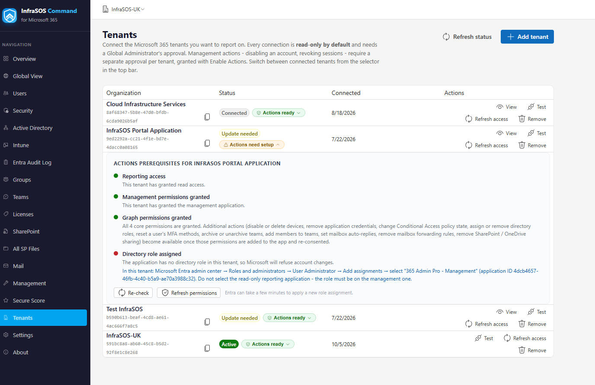

# Connecting tenants

A tenant becomes available in 365 Command when an administrator grants consent to it. Reporting and
management are **two separate consents**, to two separate applications, so you can connect a tenant
read-only and decide about management later - or never.

## The two applications

| Application | Grants | When |
| --- | --- | --- |
| **InfraSOS Command** (reporting) | Read-only access for every report | Connecting a tenant |
| **InfraSOS Command - Management** | The write access behind Actions | Only if you turn on management |

Admin consent is all-or-nothing per application, so keeping read and write in separate
registrations is deliberate: it means connecting a tenant never asks anyone to approve write access,
and a tenant that only wants reporting is never granted more than it needs. The exact permissions
each one requests are listed in [Permissions](permissions.md).

/// caption
The Tenants page: connect a tenant, enable Actions, and refresh access.
///

## Connect a tenant (reporting)

1. Open the **Tenants** page and choose **Add tenant** (or **Connect**).
2. You are redirected to Microsoft's own **admin consent** screen for your tenant, which lists the
   read permissions. Review and **Accept**.
3. Microsoft returns you to 365 Command and the tenant appears, with its reports ready.

The consent is granted in the customer tenant's own directory and can be reviewed or revoked there
at any time (Entra admin center → Enterprise applications).

### Connecting a tenant you are not an administrator of

As an MSP or consultant you often do not hold admin rights in the customer's tenant. Consent must be
granted by **their** administrator, so send the consent link to a Global Administrator in that
tenant - they approve it in their own sign-in, and the tenant then appears in your console. You do
not gain any standing access to their directory beyond what the application permissions allow, and
they can revoke it on their side whenever they choose.

## Turn on management (Actions)

Reporting never changes anything. To enable the actions that do - disabling an account, resetting a
password, managing licences and groups, onboarding and offboarding - grant the **management**
application as well:

1. On the **Tenants** page, choose **Enable Actions** for the tenant.
2. Approve the admin-consent screen for **InfraSOS Command - Management**, which lists the write
   permissions.
3. Assign the management application the **User Administrator** directory role in that tenant. Graph
   requires a directory role to change accounts, so without it the actions are consented but still
   refused. Two actions need a higher role - see [Permissions](permissions.md#directory-roles).

Management is gated **per action**: each one is offered only when the specific permission it needs
is present, so a tenant that consented before a newer action existed keeps everything else working
and sees only that action disabled, with the reason, until it re-consents.

## Keeping access current

When 365 Command gains a new capability that needs a new permission, already-connected tenants are
flagged with an **update available** note. Choose **Refresh permissions** (reporting) or **Refresh
access** on the tenant to re-run consent and pick up the new scopes. Nothing you already had stops
working in the meantime; only the new capability waits on the refresh.

!!! tip "If an action is disabled or fails"
    A disabled action tells you in its tooltip exactly what it needs - usually a permission to add
    and re-consent, or a directory role to assign. An action that was allowed but returns
    "insufficient privileges" almost always means the management application is missing the
    directory role for that operation. [Troubleshooting](troubleshooting.md) lists the common cases.

## Removing a tenant

Remove a tenant from the **Tenants** page to stop reporting on it in your console. To revoke the
access itself, the tenant's administrator deletes the InfraSOS Command (and, if granted, InfraSOS
Command - Management) entries from **Enterprise applications** in their Entra admin center. Doing
both leaves nothing behind.

## Next

- [Permissions](permissions.md) - the complete list of what each application requests, and the
  directory roles management needs.
