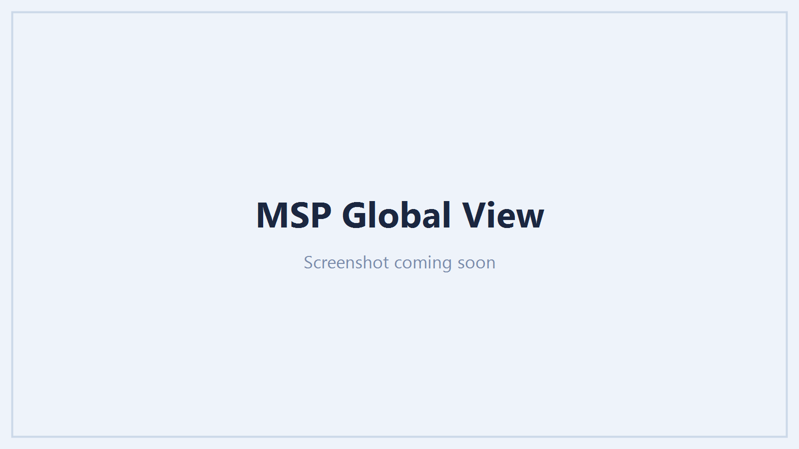

# MSP Global View

Once you manage more than one tenant, the **Global View** is the command centre across all of them -
built for MSPs and anyone running several tenants, so you work the fleet rather than clicking through
tenants one at a time.

## What it shows

- **Headline KPIs** across the fleet: tenants, critical exposures, and the posture at a glance.
- **Priority actions.** The things worth doing now - admins without MFA, risky sign-ins, unused
  licences, tenants that need a consent refresh - each one opening a list of the **affected
  tenants**, worst first, with a link straight to the relevant report in that tenant.
- **A tenant table**, sortable and expandable, one row per tenant.
- **Fleet trends** over the last 30 days.
- **Recent changes** across tenants.

/// caption
The Global View: priority actions and a sortable tenant table across the whole fleet.
///

## The tenant columns

Each tenant row carries its posture at a glance:

| Column | Shows |
| --- | --- |
| **Secure Score** | The tenant's Microsoft Secure Score, with its 30-day change |
| **MFA** | MFA coverage |
| **Conditional Access** | Whether any policy enforces MFA and blocks legacy auth |
| **Privileged risk** | Administrators with no MFA capability |
| **App risk** | User-consented apps holding a sensitive delegated scope |
| **Devices** | Intune-enrolled devices |
| **Change** | The 30-day movement, as a sparkline |

## Zero is not the same as unknown

A metric reads as a number only when it was actually computed. Where it could not be - a missing
permission, a licence the tenant does not have, or Graph returning nothing - the cell is greyed
**Unavailable** with the reason, and is never shown as a zero. A genuine zero (no risky users, say)
reads as zero; "we could not check" reads as grey. The two are kept visibly distinct so a blank is
never mistaken for good news.

## Trends and history

Point-in-time columns are read live. The trend and change columns are built from a **daily
snapshot** taken per tenant, so they begin to show movement once there are at least two days of
history and fill out over the following month.

## Drilling in

A priority action, or any tenant row, opens into that tenant: the Global View hands you off to the
exact report that explains the number, in the tenant it belongs to, so investigating a fleet-level
figure lands you where you can act on it.
