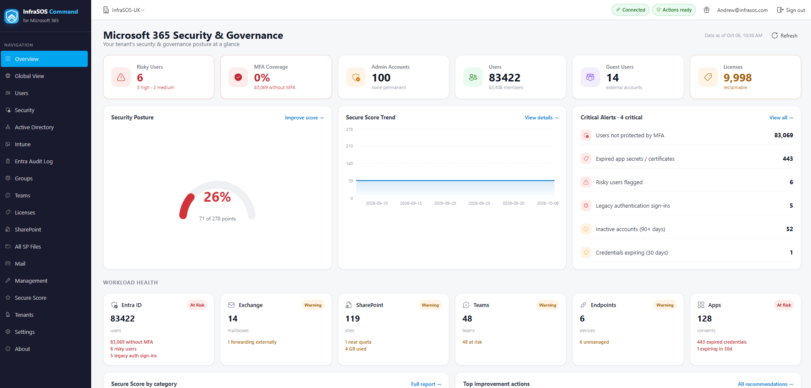

# 365 Command

365 Command is a hosted console that reports on and manages **Microsoft 365 and Entra ID**. You
connect a tenant with admin consent and work from a browser at
[command.infrasos.com](https://command.infrasos.com) - there is nothing to install, and no agent or
script runs anywhere in your environment.

It is **read-only by default**. Reporting needs only read access. Management - the actions that
change a tenant - runs through a separate application that an administrator opts into per tenant, so
no customer is shown a write-access consent screen they did not ask for. See
[Permissions](permissions.md) for exactly what each side requests.

/// caption
The overview: a connected tenant's headline counts and what most needs attention.
///

## What it does

- **Reporting.** Users, licences, groups, mailboxes and mail flow, Teams, SharePoint and OneDrive,
  guests and devices - filterable, with chooseable columns, and exportable to CSV, HTML or PDF.
- **Security posture.** Microsoft Secure Score with a trend, MFA coverage, risky users, Conditional
  Access, admin exposure and the apps users have consented to, ranked so the biggest risks rise to
  the top.
- **Intune.** Managed devices, compliance state and the endpoints that need attention, pulled into
  one place rather than spread across the Intune admin center. See [Intune](intune.md).
- **Management.** Disable or enable accounts, revoke sessions, reset passwords, manage licences and
  group membership, onboard a starter and offboard a leaver through guided wizards, and run the same
  actions in bulk. Every change confirms first and is written to an audit trail. See
  [Management actions](management-actions.md).
- **MSP Global View.** One command centre across every connected tenant: priority actions, a
  sortable tenant table, fleet trends and cross-tenant recent changes. See
  [MSP Global View](global-view.md).

## What it deliberately does not do

- **It does not change anything until you opt in.** A tenant you connect is read-only. Management
  actions require a second, separate consent, and even then each action is gated on the exact
  permission it needs - so an unconsented action shows disabled with its reason rather than failing.
- **It runs nowhere near your network.** Everything is read on demand through Microsoft Graph. There
  is no connector to deploy, no service account to create and no inbound access to grant.
- **It does not invent data.** A figure it cannot compute - because a permission is missing, a
  licence is absent, or Graph returned nothing - renders as a greyed **Unavailable** with the
  reason, never as a zero or an estimate.
- **It is not for on-premises Active Directory.** That is a different product with a different
  deployment model: see [AD Command](../ad-command/index.md) for reporting and security on a domain
  controller, and [AD Command Pro](../ad-command-pro.md) for directory management.

## How it is hosted

365 Command is hosted by InfraSOS. You subscribe once (through the Microsoft commercial marketplace
or directly, with a 30-day trial), then connect one or more customer tenants by admin consent.
Reports are read live from Graph and cached briefly in memory to keep the console responsive; the
only things kept are the list of connected tenants, your subscription, and the management action
audit trail.

## Where to start

New to the product: [Getting started](getting-started.md), then
[Connecting tenants](connecting-tenants.md) and [Permissions](permissions.md).

Already connected: [Reporting](reporting.md), [Security](security.md),
[Management actions](management-actions.md), [Intune](intune.md) and
[MSP Global View](global-view.md).

Something is not working: [Troubleshooting](troubleshooting.md).
