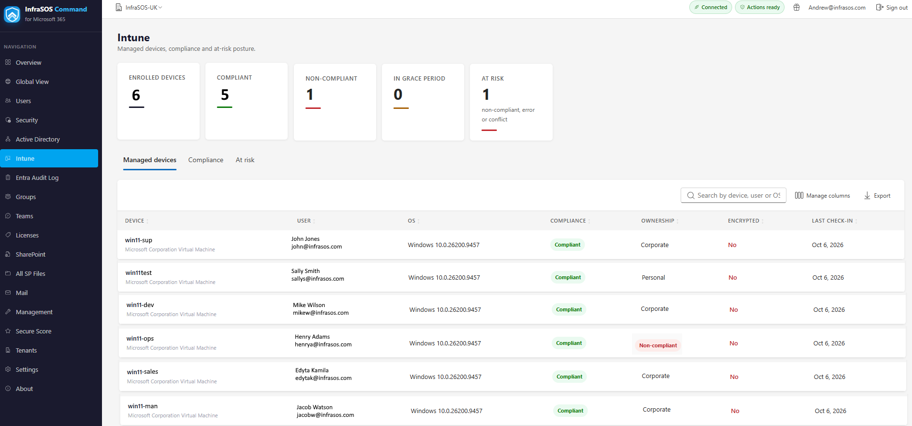

# Intune

The Intune page pulls the answers that matter about your managed devices into one place, rather than
spread across the Intune admin center: how many devices are enrolled, how many are compliant, and
which ones need attention now.

## What it shows

- **Managed devices.** One inventory across Windows, macOS, iOS and Android, with ownership,
  enrollment type, last check-in, and compliance and encryption state per device.
- **Compliance.** The compliant, in-grace and non-compliant split, with a breakdown of what is
  driving it.
- **At risk.** The endpoints to act on first - non-compliant, gone quiet, unencrypted, or jailbroken
  and rooted - each with the reason it was flagged.

/// caption
Managed devices with compliance and the at-risk endpoints in one place.
///

## Requirements

The Intune page needs two things in the tenant:

- The reporting application must hold **`DeviceManagementManagedDevices.Read.All`** (added to the
  reporting app and picked up with **Refresh permissions**).
- The tenant must be **licensed for Intune**.

!!! note "No devices are ever invented"
    Until both are true, the page shows an honest panel explaining which one is missing - the
    permission to grant and refresh, or that the tenant is not licensed for Intune - rather than a
    list of mock devices. A tenant with no Intune does not read as "zero devices"; it reads as "not
    licensed for Intune".

## In the Global View

Each tenant's Intune-enrolled device count also appears as a column in the
[MSP Global View](global-view.md), greyed with "not licensed for Intune" where that applies, so a
blank there means the same honest thing.
