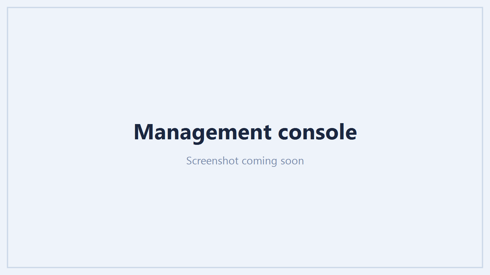

# Management actions

Management is what separates 365 Command from a reporting tool: you can act on what a report shows,
safely, from the same console. It is off until you turn it on, granted per tenant, and every change
is confirmed and recorded. Enabling it is covered in [Connecting tenants](connecting-tenants.md);
the permissions and directory roles it needs are in [Permissions](permissions.md).

## How actions stay safe

- **Opt-in per tenant.** Nothing can change a tenant until an administrator consents the management
  application for it.
- **Gated per action.** Each action is offered only when the specific permission (and, for account
  and role changes, the directory role) it needs is present. A tenant missing one keeps every other
  action working and sees only that one disabled, with the reason.
- **Confirmed.** A destructive action always asks first, and the confirmation names the person or
  object and spells out the consequence.
- **Recorded.** Every action is written to a per-tenant audit trail: who did it, what, to whom, and
  the result. The trail cannot be edited or deleted.

## Where actions appear

- **On a report row.** The **Actions** menu on a user, group, device, policy or app row runs the
  actions that apply to it.
- **The Management console.** A console view with headline KPIs, a **needs attention** list of
  accounts worth acting on, quick actions, and a **bulk operations** tab.
- **In bulk.** Filter a report to the accounts you mean, select them, and run one action across the
  selection, with a per-row result so you know exactly what happened to each.

/// caption
The Management console: headline KPIs, a needs-attention list, quick actions and bulk operations.
///

## Everyday actions

Disable or enable an account, revoke sign-in sessions, require a password change, remove licences,
add or remove group members, create or delete a group, archive a team, revoke an app consent,
disable or delete a device, change a Conditional Access policy's state, remove an application
credential. Each needs its matching permission from [Permissions](permissions.md).

## Onboarding a starter

The **onboarding** wizard creates a new user in one guided flow: the account and its sign-in domain,
the manager, the licences to assign, and the groups and teams to add them to - so a starter is
productive without a checklist of separate tasks.

## Offboarding a leaver

The **offboarding** wizard runs the whole leaver process from one panel, each step optional and
confirmed: block sign-in, revoke sessions and reset the password, reassign owned groups and direct
reports, remove inbox rules, revoke app consents, disable devices, and reclaim licences. Mailbox
steps that depend on Exchange Online (convert to shared, delegate access, set an out-of-office, hide
from the address list) are rolling out as the Exchange integration lands.

/// caption
The offboarding wizard: each leaver step optional and confirmed.
///

## Role and MFA actions

Three actions act on a user's privileges and need a directory role beyond the baseline:

- **Reset MFA** removes a user's registered authentication methods so they must re-register. Needs
  `UserAuthenticationMethod.ReadWrite.All` and the **Authentication Administrator** role (Privileged
  Authentication Administrator if the account is itself an administrator).
- **Assign directory role** grants a role to a user from a searchable picker of every role. Needs
  `RoleManagement.ReadWrite.Directory` and the **Privileged Role Administrator** role.
- **Remove directory role** removes a role the user currently holds - the picker lists only the roles
  they have. Needs the same `RoleManagement.ReadWrite.Directory` permission and **Privileged Role
  Administrator** role.

All three are available on a user row, in the Users bulk menu, and on the Management console. In
bulk, Assign and Remove ask for one role and apply it across the selection (users who do not hold the
role on a Remove are reported as not changed). They are deliberately advanced: a tenant can run every
other action without granting them, and when one is attempted without its role the failure names
exactly which role to assign. See [Permissions → Directory roles](permissions.md#directory-roles).

## The audit trail

The **Audit** view lists every management action taken through 365 Command for a tenant, newest
first, with the operator, the action, the target and whether it succeeded. Because delegation to a
team should never mean losing track of who did what, the trail is immutable.
