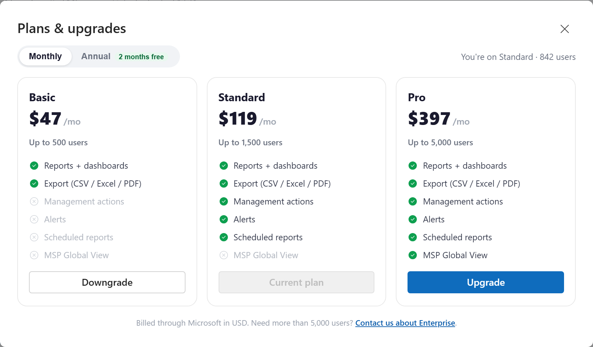

# Plans and billing

InfraSOS Command comes in four plans, Free, Basic, Standard and Pro, plus a private
Enterprise plan for the largest tenants. Each plan unlocks more capabilities and a
higher user allowance. Billing is handled through Microsoft, so a plan change shows
up on the same Microsoft invoice as the rest of your Microsoft 365 subscriptions.

You can change plan yourself from inside the portal at any time.

## What each plan includes

| | Free | Basic | Standard | Pro |
|---|:---:|:---:|:---:|:---:|
| Users (total, across unlimited connected tenants) | 25 | 500 | 1,500 | 5,000 |
| Reports and dashboards | ✓ | ✓ | ✓ | ✓ |
| Export (CSV / Excel / PDF) | | ✓ | ✓ | ✓ |
| Invite your team | | ✓ | ✓ | ✓ |
| Management actions | | | ✓ | ✓ |
| Alerts | | | ✓ | ✓ |
| Scheduled reports | | | ✓ | ✓ |
| MSP Global View | | | | ✓ |
| Connected tenants | 1 | Unlimited | Unlimited | Unlimited |
| Portal users (your delegated team) | 1 | Unlimited | Unlimited | Unlimited |

Need more than 5,000 users, or a tailored agreement? The **Enterprise** plan removes
the user cap and includes everything, as a private offer. Use the "Contact us about
Enterprise" link in the plan picker to get in touch.

!!! note "The user cap is a soft limit"
    The user count is the total across every tenant you have connected, with no
    per-tenant fee. On paid plans, if you go over your cap, reporting you already
    rely on keeps working, you are simply asked to upgrade before connecting another
    tenant. On the **Free** plan, each report shows the first 25 rows with a prompt
    to upgrade and see (and export) the rest; the summary totals still reflect your
    whole tenant.

## Changing your plan

1. Open the plan picker. Click the **plan chip** in the top bar (it shows your
   current plan and usage, for example "Standard 842/1,500"), or select **Upgrade**
   on any feature that your plan does not yet include.
2. Choose **Monthly** or **Annual** billing. Annual is billed yearly with two months
   free.
3. On the plan you want, select **Upgrade** or **Downgrade**.

An **upgrade** takes effect right away (occasionally after a short processing delay),
and the new features unlock as soon as the change is confirmed. A **downgrade** is
allowed as long as your current user count fits within the lower plan's cap; if it
does not, reduce your connected users first.

### Moving from Free to a paid plan

The Free plan is not a Microsoft subscription, so moving to Basic, Standard or Pro
starts a one-time purchase on the Microsoft Marketplace. The portal takes you there,
and once the purchase completes you are dropped straight back into your workspace on
the new plan.

### Free trial

New customers can start a **free trial** of the full platform, including the MSP
Global View, from the plan picker or the marketplace listing. The trial runs for one
month, then converts to the paid plan unless you change it first. A couple of days
before it ends, the portal shows a reminder banner and emails the account, so nobody
is billed by surprise: switch to the plan that fits, or keep going on the current one.

## Where billing and invoices live

Prices are in US dollars and billing runs entirely through Microsoft. To see invoices,
change your payment method, or cancel, open the subscription in the **Azure portal**
or the **Microsoft 365 admin center** where you bought it. The current price for each
plan is always shown in the plan picker and on the marketplace listing.
