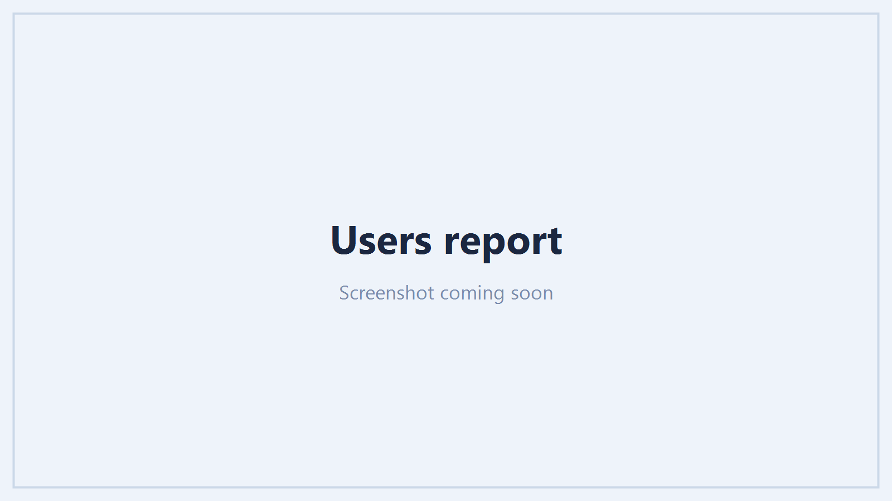

# Reporting

Reporting is read-only and needs only the reporting application. Every report reads live from
Microsoft Graph, so what you see is the tenant as it is now, not a nightly snapshot.

## The reports

| Report | Covers |
| --- | --- |
| **Overview** | Headline counts and the things most worth attention, as a landing page |
| **Users** | Every account: type, status, licences, MFA state, last sign-in and more |
| **Groups** | Security and Microsoft 365 groups, membership, ownership and type |
| **Licences** | Subscriptions, assigned and available seats, and who holds what |
| **Mail** | Mailboxes, mail flow, and forwarding - including rules that send mail outside the tenant |
| **SharePoint & OneDrive** | Sites, storage, inactive sites and external sharing |
| **Teams** | Teams, channels, guests and membership |
| **Guests** | Guest accounts, who invited them and when they last signed in |
| **Devices** | Registered and joined devices (Intune-managed devices have their own page) |

/// caption
A report: searchable and filterable, with chooseable columns and export to CSV, HTML or PDF.
///

## Working with a table

Every report shares the same controls, so what you learn on one applies to all:

- **Search** filters the table as you type.
- **Filters** narrow by the categorical columns - account type, enabled state, licence and so on -
  from plain-language "All …" dropdowns.
- **Manage columns** chooses which columns show. Your choice is remembered per report.
- **Sort** by clicking a column header.
- **Refresh** re-reads the report from Graph, bypassing the short cache that keeps paging fast.

!!! note "Large tenants page as you scroll"
    Big reports load in pages rather than all at once. Searching and filtering apply across the
    whole report, not only the rows already loaded.

## Exporting

Any report exports to **CSV**, **HTML** or **PDF**. The export reflects the filters and columns you
have set, so you send exactly the view you are looking at. Exports carry a footer identifying the
tenant and when it was produced.

!!! warning "Exports contain directory data"
    A report export can include names, email addresses and sign-in detail. Treat the file as you
    would any extract of directory data.

## Acting on what you find

Where management is enabled, report rows carry an **Actions** menu - disable a stale account, revoke
a guest's sessions, remove a licence - so you can fix what a report surfaces without leaving it. The
actions, their safeguards and the permissions they need are covered in
[Management actions](management-actions.md).

## Security reporting

The security-specific reports - Secure Score, MFA coverage, risky users, Conditional Access, admin
exposure and consented apps - have their own page: [Security](security.md).
