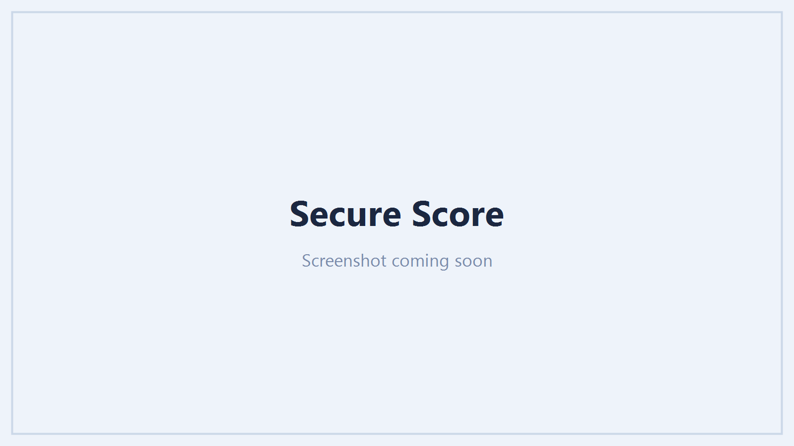

# Security

The Security pages assess a tenant's identity and access posture and, where management is enabled,
let you fix what they find from the same screen. Findings lead with what to act on, ranked so the
biggest risks are at the top.

## What it assesses

| Page | Shows |
| --- | --- |
| **Secure Score** | Microsoft Secure Score, a 30-day trend, a breakdown by category, and the recommended actions with the biggest point gains |
| **MFA coverage** | Who is MFA-capable, which methods they use, and who still has none |
| **Risky users** | Identity Protection risky users and detections, ranked by risk level |
| **Conditional Access** | Every policy, whether it is enabled, report-only or off, who it targets and what it enforces |
| **Admin exposure** | Accounts holding directory roles, and standing privileged access |
| **App consents** | Applications users have consented to, and the delegated scopes they hold |
| **Sign-in failures / Legacy auth** | Sign-in logs that bypass or fail modern authentication |
| **Devices / App registrations** | Device records and application credentials (secrets and certificates) |

/// caption
Secure Score with a 30-day trend and the highest-impact recommended actions.
///

## Reading a finding

Tables are ordered worst first. Each row carries the detail behind it - which users, which policy,
which scope - and, where an action applies, an **Actions** menu to resolve it: enable a Conditional
Access policy, revoke an app consent, remove a stale credential, disable an exposed account.

## Licensing and honest gaps

Some assessments depend on an Entra ID licence:

- **Risky users** and Identity Protection detections need **Entra ID P2**.
- Some Conditional Access and sign-in insights are richer with **Entra ID P1**.

Where a tenant lacks the licence or the permission, that panel shows a greyed **Unavailable** with
the reason rather than an empty or misleading figure. See [Permissions](permissions.md) for the read
scopes each assessment uses.

## Fixing from here

The Conditional Access, admin, consent, device and credential actions are management actions and
need the management application plus the relevant permission. The security tables are gated **per
action**, so a tenant that has not enabled a given write permission still gets the full assessment
and simply sees that one action disabled with its reason. See
[Management actions](management-actions.md).
