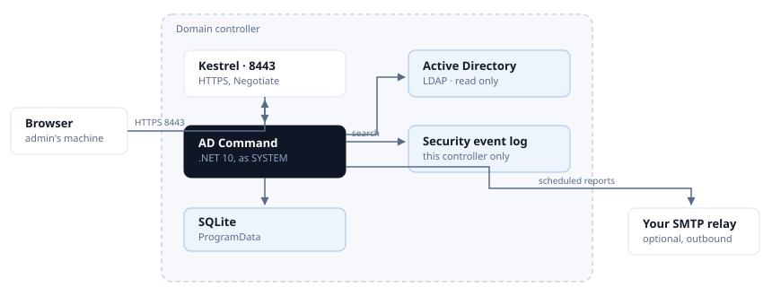

# Architecture

How AD Command is put together, what each part talks to, and - the part that matters most on a
domain controller - what each part costs.

## Where it runs

One Windows Service, `InfraSOSADCommand`, on the domain controller itself. Not an agent reporting to
a collector, and not a console reaching in from elsewhere: there is no second machine and no second
thing to install, patch or firewall.

/// caption
One service on the controller. One inbound port, and one optional outbound path.
///

Everything inbound is one port. Everything outbound is your own relay, and only if you configure it.

## The parts

| | What it is | What it touches |
| --- | --- | --- |
| **Kestrel** | The web server, HTTPS on 8443 | Nothing else. Not IIS - there is no web server to install or harden |
| **API** | ASP.NET Core minimal APIs under `/api/v1` | Everything below |
| **Directory reader** | `System.DirectoryServices.Protocols` over LDAP | Active Directory, **read only** |
| **Windows state reader** | Registry, `auditpol`, service configuration, event log | The local machine |
| **Control pack** | The security assessment, versioned separately from the product | Both readers |
| **SQLite** | Assessment history, acknowledgements, audit log, schedules, daily counts | A file in ProgramData |
| **Console** | React, served as static files by the same Kestrel | The API, nothing else |

### Nothing writes to Active Directory

Not "writes are restricted" - there is no code path that writes. Every directory operation is a
search. That is why the product can run as SYSTEM on a controller without that being a risk somebody
has to accept: the worst an attacker who reached the console could do is read what an administrator
can already read.

Directory management is [AD Command Pro](../ad-command-pro.md), which runs on a member server under
a delegated account, where Active Directory itself enforces what it may do.

## Authentication

Windows Integrated Authentication - the same identity you already signed in with. There is no
product account, no password to rotate and nothing to leak.

Roles come from group membership: **Administrator** from `BUILTIN\Administrators`, `Domain Admins`,
`Enterprise Admins` or a group you nominate; **Operator** from a group you nominate; everybody else
is read-only.

!!! note "If the console says Read only and you are a Domain Admin"
    Windows gave your browser a *filtered token*, which marks administrative groups deny-only. The
    product is reading your token correctly, and treating a deny-only group as membership would hand
    administrative use of a domain controller to any non-elevated program running as you.

    Negotiate also requires HTTP/1.1 - it is connection-bound and does not work over HTTP/2. Browsers
    handle that themselves; anything scripting the API needs to know it.

## What runs on its own

Four background loops, and their cost is the reason each one is shaped the way it is.

| Loop | How often | What it reads | Cost |
| --- | --- | --- | --- |
| **Security assessment** | Daily, configurable | Registry, `auditpol`, LDAP, a TLS probe per controller | The most expensive thing the product does. ~125 ms on a small domain |
| **Event counter** | Continuous | This controller's Security log | Counts only. Event bodies are never copied into the database |
| **Report sweep** | Every minute | **SQLite**, and a local registry read | Negligible. It asks the database what is due, never the directory |
| **Directory snapshot** | Six-hourly, **counts once a day** | LDAP | One pass per day. See below |

### Why the snapshot counts once a day

LDAP has **no server-side count**. Asking how many users exist means enumerating every user and
counting them. The daily snapshot does that for users, groups, computers, organisational units and
four filtered populations - on a fifty-thousand-user estate, six figures of entries.

The loop ticks every six hours so a controller that is switched off each evening still records the
day. It checks whether the day already has a row **before** counting, so that cadence costs one pass
rather than four. The row is keyed on the date and replaced, which is also what keeps the series
evenly spaced - and an evenly spaced series is the only kind a trend line can honestly be drawn
from.

### Measured on a domain controller

Two vCPUs, Windows Server 2022, product 0.2.86:

- **At rest: 0.31% of one core**, 130 MB working set, 26 threads.
- All fourteen scheduled reports rendered back to back: **975 ms wall, 250 ms CPU** combined.
- A full thirty-nine-control security assessment: **~125 ms**.

Those figures are from a small directory and do not extrapolate; the shapes above do. What scales
with directory size is anything that enumerates - the snapshot, the group reports, the account
reports. What does not is the assessment's registry and policy checks, the report sweep, and
everything the console does between page loads, which is nothing.

## What it never does

- **It does not read other controllers' event logs.** Event logs do not replicate. What monitoring
  shows is what *this* controller recorded, and the console says so rather than implying the domain.
- **It does not need Internet access.** It ships its own documentation, renders reports with no
  external assets, and expects a private subnet. This site is an addition, never a replacement.
- **It does not phone home.** No telemetry, no licence check, no outbound call of any kind. The only
  thing that ever leaves is a scheduled report, to your relay, to domains you allowed.
- **It does not store credentials.** There is one secret it can hold - an SMTP relay password - and
  it is protected with DPAPI at machine scope, beside the database and never inside it. No endpoint
  returns it.

## Data it keeps

One SQLite file in `%ProgramData%\InfraSOS\AD Command`, holding assessment history and scores,
acknowledged risks, the administrator audit log, report schedules and their outcomes, event counts,
and the daily directory counts.

It holds **no directory content**: no account names beyond what an audit entry needs to be
meaningful, no group memberships, no event bodies. A copy taken for support describes what the
product did, not what your directory contains - with one exception worth knowing, which is that the
support bundle includes the current security assessment, and that describes where your domain is
weak. Treat it accordingly.
