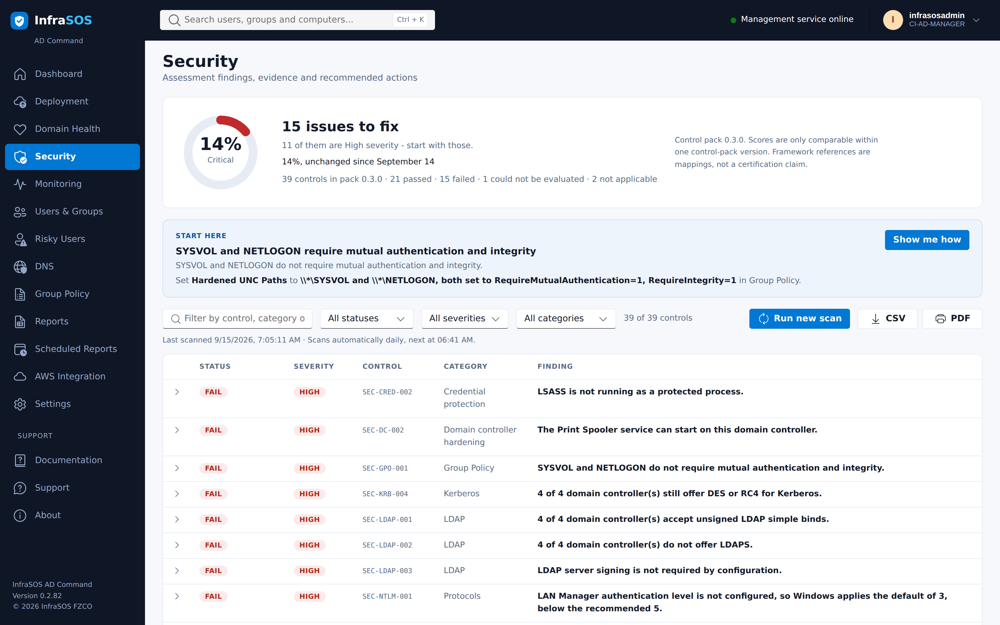
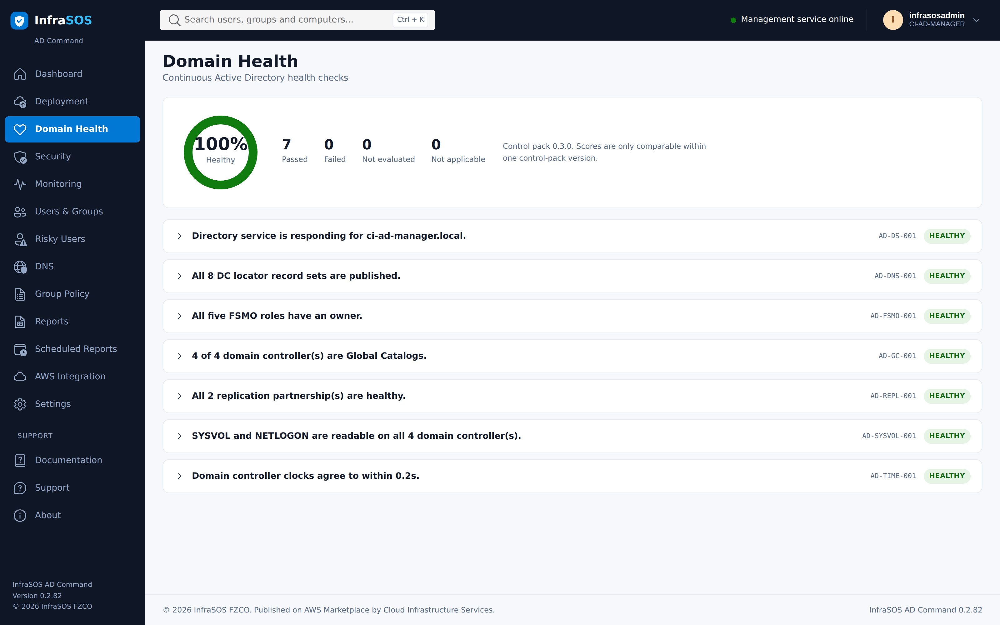
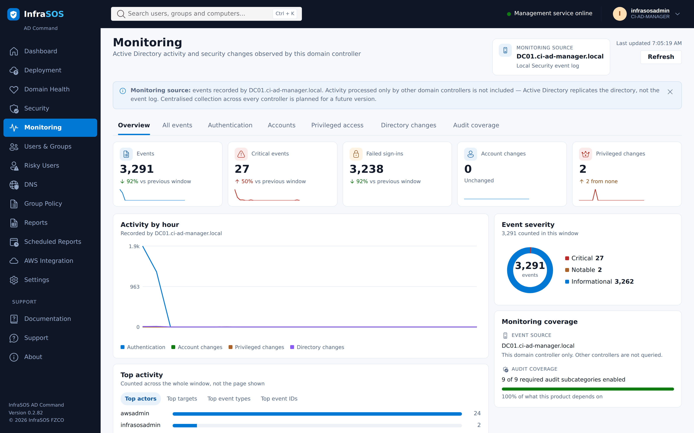
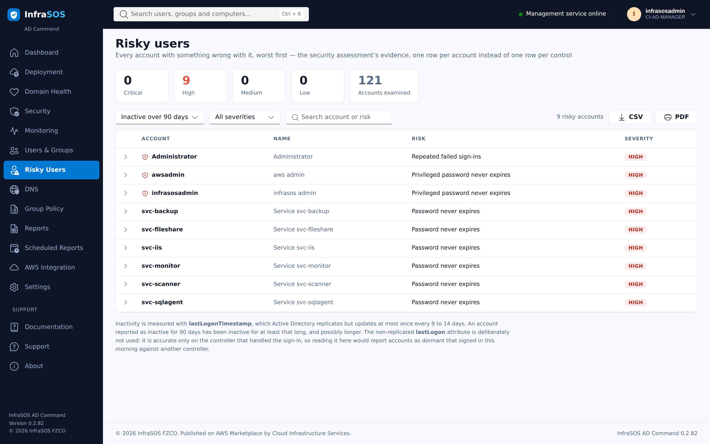
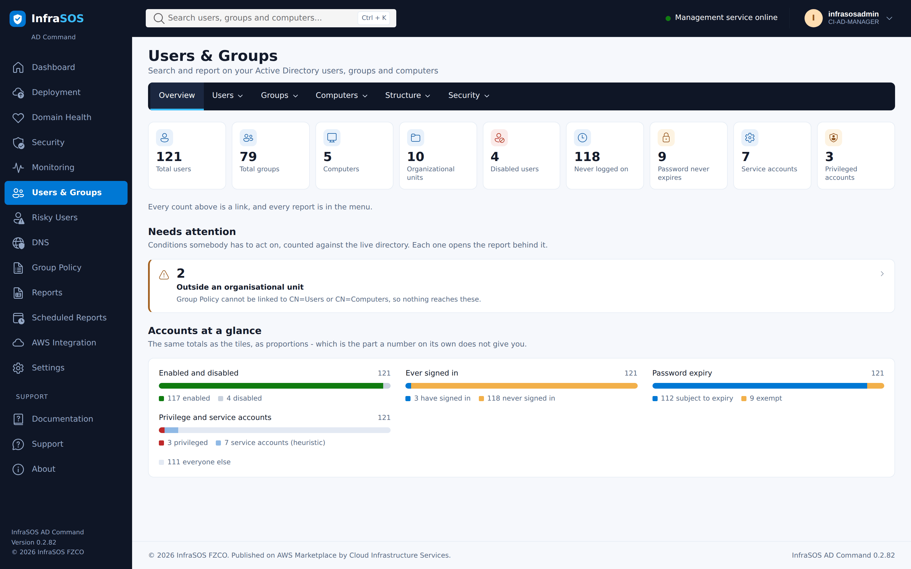
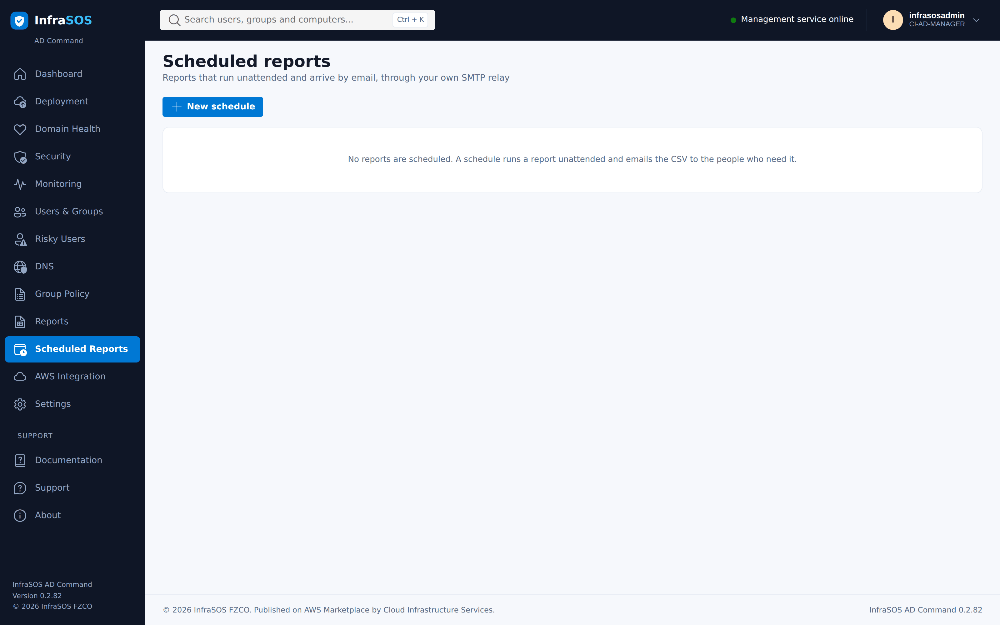

# AD Command

AD Command deploys, assesses, monitors and reports on a Microsoft Active Directory domain, running
**on the domain controller itself**. It is distributed as an AWS Marketplace AMI and billed on
instance usage.

## What it does

- **Deployment.** Promote the instance to a domain controller - a new forest, or an additional
  controller in an existing domain - with preflight checks and a promotion that survives the reboot.
- **Security assessment.** A versioned pack of Active Directory controls evaluated against your
  domain, with a documented score, remediation for every finding, and a way to accept a risk on the
  record. See [Scoring](scoring.md) for the arithmetic.
- **Domain health.** Replication, FSMO roles, global catalogue, DNS, time and SYSVOL.
- **Monitoring.** Security events from **this controller's** log, explained individually rather than
  listed.
- **Users, groups and reports.** Account risk, privileged access, password expiry, delegation, LAPS
  coverage, group hygiene and more, exportable and schedulable by email.

## What it deliberately does not do

- **It does not change your directory.** Every operation is a read. Directory management belongs to
  [AD Command Pro](../ad-command-pro.md), which runs on a member server under a delegated account
  where Active Directory can enforce what it may do.
- **It does not monitor other domain controllers' event logs.** Event logs do not replicate. What it
  reports is what this controller recorded, and the console says so rather than implying
  domain-wide coverage.
- **It does not need Internet access.** It ships its own documentation, renders its reports without
  external assets, and expects to run in a private subnet.

## What it looks like

Every screenshot here is the console running on a real domain controller, not a mock-up. The domain
is a small test forest, so the numbers are small and the security score is poor - which is what a
domain that nobody has hardened yet actually looks like.

### Security assessment

Findings are listed worst first and lead with a count of things to fix rather than a percentage,
because the count is what you act on. Each row expands to the evidence the product read, how to fix
it, and any caution worth knowing first.

### Domain health

### Monitoring

Events from **this controller's** Security log, each one explained rather than listed. Event logs do
not replicate between domain controllers, so the page says whose log it is reading rather than
implying the whole domain.

### Risky users

### Users, groups and reports

### Scheduled reports

Reports run unattended and arrive by email through your own SMTP relay. Recipients are restricted to
domains an administrator has allowed, because the attachment contains directory data.

## Where to start

New to the product: [Getting started](getting-started.md), then
[Deploying a domain controller](deploying-a-domain-controller.md).

Already running it: [The security assessment](security-assessment.md),
[Users, groups and reports](users-and-groups.md), [Scheduled reports](scheduled-reports.md) and
[Operations](operations.md).

Something is wrong: [Troubleshooting](troubleshooting.md).
