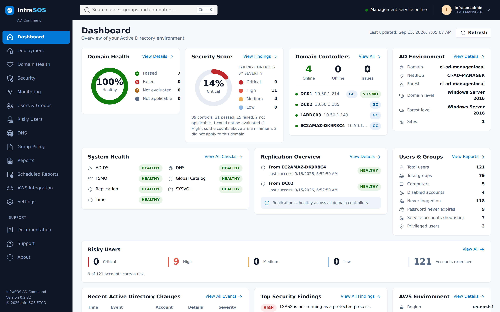

---
hide:
  - navigation
---

# InfraSOS documentation

**Monitor, audit and secure your identity infrastructure.** Documentation for the InfraSOS product
family. **AD Command** is available now; the other two are in development, and have placeholder
pages so the structure of this site is honest about what exists.

/// caption
The AD Command dashboard, running on a live domain controller.
///

## Where do you want to start?

-   :material-shield-check:{ .lg .middle } **AD Command** &nbsp; Available

    ---

    Deployment, security assessment, health and monitoring for Active Directory, running **on a
    domain controller**. Distributed as an AWS Marketplace AMI and billed on instance usage.

    [:octicons-arrow-right-24: Read the documentation](ad-command/index.md)

-   :material-account-edit:{ .lg .middle } **AD Command Pro** &nbsp; In development

    ---

    Everything AD Command does, plus **directory management** - unlock, reset, enable and disable
    accounts, group membership and attribute edits - on a domain-joined member server.

    [:octicons-arrow-right-24: What is planned](ad-command-pro.md)

-   :material-microsoft-office:{ .lg .middle } **365 Command** &nbsp; In development

    ---

    Microsoft 365 reporting and management. A separate product rather than a module of the others,
    because it authenticates to a different directory and shares no deployment model with them.

    [:octicons-arrow-right-24: What is planned](365-command.md)

-   :material-lifebuoy:{ .lg .middle } **Support**

    ---

    What to try first, what the support bundle contains and what it deliberately does not, and how
    to reach us.

    [:octicons-arrow-right-24: Get help](support.md)

## What AD Command does

-   :material-magnify-scan:{ .lg .middle } **Detect security risks**

    ---

    Scan your domain controllers against thirty-nine Active Directory controls covering privileged
    access, delegation, Kerberos, LDAP, password policy and auditing. Every finding carries the
    evidence behind it and remediation written as steps.

    Framework references are mappings, not a certification claim.

-   :material-pulse:{ .lg .middle } **Monitor the events that matter**

    ---

    Privileged group changes, account lockouts, failed sign-ins and directory changes - each one
    explained rather than listed.

    Read from **this controller's** Security log. Event logs do not replicate, and the console says
    whose log it is reading rather than implying the whole domain.

-   :material-file-chart:{ .lg .middle } **Report on users, groups and access**

    ---

    Account risk, privileged access, password expiry, delegation, LAPS coverage, group hygiene,
    stale computers and Group Policy. Exportable, and schedulable by email through your own SMTP
    relay.

-   :material-heart-pulse:{ .lg .middle } **Deploy and keep it healthy**

    ---

    Promote a new forest or an additional controller with preflight checks and a promotion that
    survives the reboot, then watch replication, FSMO roles, the global catalogue, DNS, time and
    SYSVOL.

-   :material-eye-off:{ .lg .middle } **It does not change your directory**

    ---

    Every operation is a read. No code path writes to Active Directory, so there is no operation to
    undo and no delegation to get wrong. Directory management is
    [AD Command Pro](ad-command-pro.md), which runs where Active Directory can enforce what it may
    do.

-   :material-check-decagram:{ .lg .middle } **It says when it does not know**

    ---

    A control that could not read its setting reports Unknown and caps the score rather than
    passing. It never reports a pass it did not measure, and it ships its own documentation because
    a domain controller has no route to the Internet.

## These guides also ship inside the product

A domain controller usually has no route to the Internet, and that is the correct configuration
rather than an obstacle to work around. So AD Command carries its own copy of this documentation and
renders it locally, under **Documentation** in the console.

This site is the same content with search and a table of contents. If you are reading it because
something is wrong with a domain controller, the copy on the machine itself will work when this one
does not.

